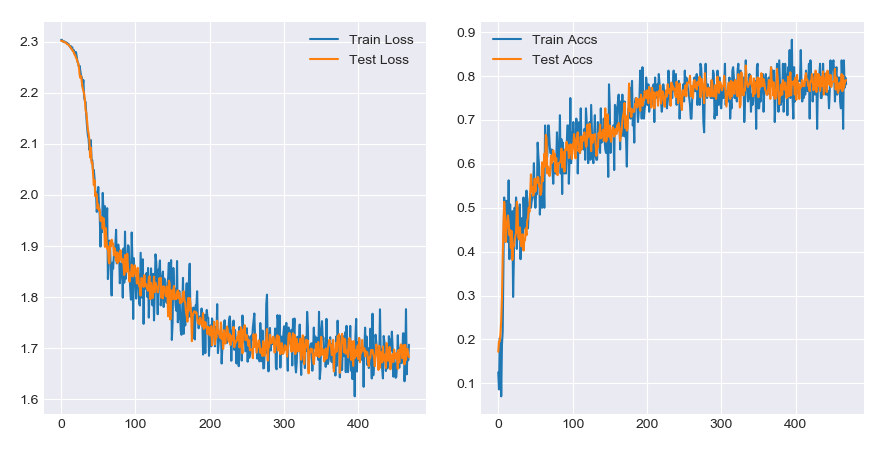

# NumPy CNN

This is a small NeuralNet-Framework implemented only with NumPy.
It contains Linear-, Convolution-, TransposedConv- and Pooling-Layers.
The Framework is not really intended to be used, because you can't save the model (yet) and it's poorly optimized,
but more for curious GitHub-user, who want to learn more about the popular Layers/Activations/etc. in NeuralNets.
 
 
 
### Requirements

For the core CNN-Frame you only need NumPy.
```
pip install numpy
```
If you want to run the FashionNet example, you need Matplotlib (for live-plotting), tqdm (loading-bar)
and gzip (read compressed trainings data).
```
pip install matplotlib
pip install tqdm
(gzip is part of the python standard library)
```
For the test_CNN script you will also need PyTorch, because I confirmed my results with the PyTorch-Autograd Engine.
```
pip install torch===1.4.0
```
or use [the PyTorch website](https://pytorch.org/)


### Testing

The ```test_CNN.py``` script runs the forward- and backwardpass of all Layers, Activations and Losses with random shaped inputs
and checks the results with the PyTorch-Autograd Engine.

I also wrote a small Network in the ```FashionNet.py``` file, which trains a small Model with the FashionMNIST dataset.
The Model was trained for only one epoch and returned some descend results. They aren't the best, but my test with the same Model in PyTorch got a similar result, so it must be the bad architecture and the short training of only one epoch.

*Note: the Testing Loss and Accuracy  is more stable because the testing batch was four times the size of the training batch*


### Features

**Layers:**
  - Linear
  - Convolution (2D)
  - Transposed Convolution (2D)  - MaxPool (2D)
 
**Activations:**
  - ReLU
  - LeakyReLU
  - Tanh
  - Sigmoid
  - Softmax
  - LogSoftmax

**Losses:**
  - MSELoss, MAELoss (L1-Loss)
  - BinaryCrossEntropyLoss
  - CrossEntropyLoss
  - SoftmaxLoss (Softmax + CrossEntropy)
  
**Optimizer:**
  - SGD (Momentum, Nesterov)
  - Adagrad
  - RMSprop
  - Adam
  
 
 
 ### Acknowledgments
 For the Softmax, LogSoftmax and CrossEntropyLoss-Module I used
 the numerical more stable functions implemented in the PyTorch Library!
 You should definetly check [this amazing Library out](https://pytorch.org/) ;) luv u :*
 
 Also a great source for Convolutions and Optimizer were [the CS231n course notes](http://cs231n.github.io/)

 
 
 
